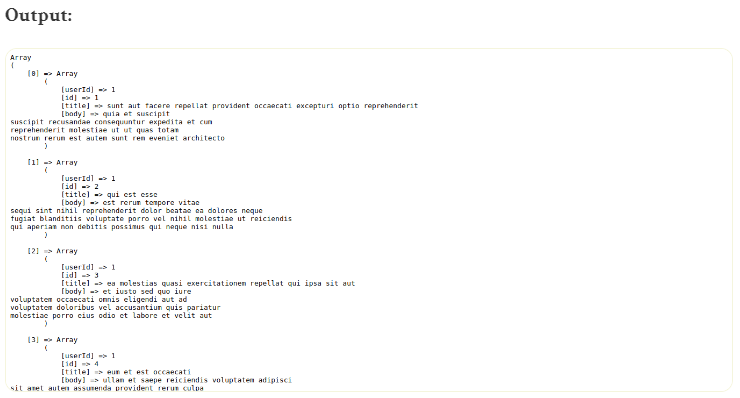
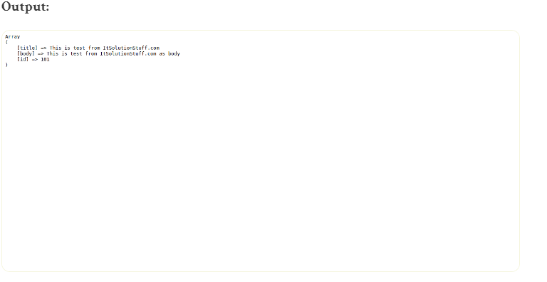
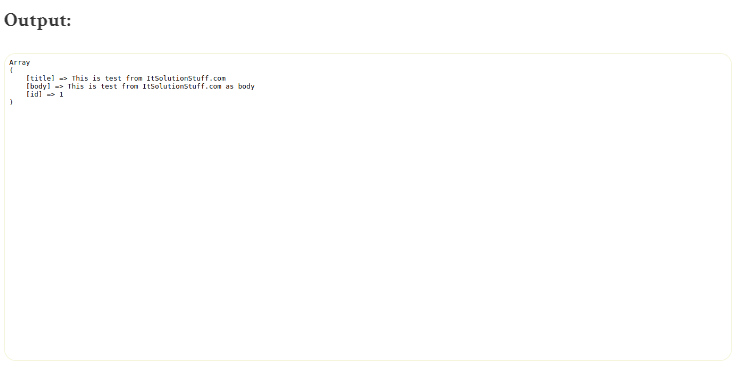
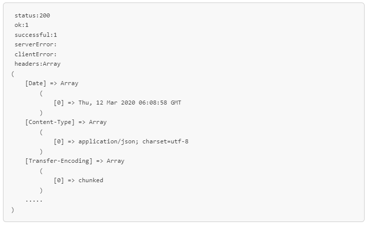

# laravel9_guzzle_http_request
## 1. Install Laravel 9
```Dockerfile
composer create-project laravel/laravel laravel9_guzzle_http_request
```
## 2. Laravel 9 HTTP cURL GET Request
- Vào routes/web.php
```Dockerfile
<?php
  
use Illuminate\Support\Facades\Route;
  
use App\Http\Controllers\PostController;
  
/*
|--------------------------------------------------------------------------
| Web Routes
|--------------------------------------------------------------------------
|
| Here is where you can register web routes for your application. These
| routes are loaded by the RouteServiceProvider within a group which
| contains the "web" middleware group. Now create something great!
|
*/
  
Route::get('posts', [PostController::class, 'index']);
```
- Vào app/Http/Controllers/PostController.php
```Dockerfile
<?php
  
namespace App\Http\Controllers;
  
use Illuminate\Http\Request;
use Illuminate\Support\Facades\Http;
  
class PostController extends Controller
{
    /**
     * Write code on Method
     *
     * @return response()
     */
    public function index()
    {
        $response = Http::get('https://jsonplaceholder.typicode.com/posts');
    
        $jsonData = $response->json();
          
        dd($jsonData);
    }
}
```



## 3. Laravel 9 HTTP cURL POST Request 
- Vào routes/web.php
```Dockerfile
<?php
  
use Illuminate\Support\Facades\Route;
  
use App\Http\Controllers\PostController;
  
/*
|--------------------------------------------------------------------------
| Web Routes
|--------------------------------------------------------------------------
|
| Here is where you can register web routes for your application. These
| routes are loaded by the RouteServiceProvider within a group which
| contains the "web" middleware group. Now create something great!
|
*/
  
Route::get('posts/store', [PostController::class, 'store']);
```
- Vào app/Http/Controllers/PostController.php
```Dockerfile
<?php
  
namespace App\Http\Controllers;
  
use Illuminate\Http\Request;
use Illuminate\Support\Facades\Http;
  
class PostController extends Controller
{
    /**
     * Write code on Method
     *
     * @return response()
     */
    public function store()
    {
        $response = Http::post('https://jsonplaceholder.typicode.com/posts', [
                    'title' => 'This is test from ItSolutionStuff.com',
                    'body' => 'This is test from ItSolutionStuff.com as body',
                ]);
  
        $jsonData = $response->json();
      
        dd($jsonData);
    }
}
```



## 4. Laravel 9 HTTP cURL PUT Request
- Vào routes/web.php
```Dockerfile
<?php
  
use Illuminate\Support\Facades\Route;
  
use App\Http\Controllers\PostController;
  
/*
|--------------------------------------------------------------------------
| Web Routes
|--------------------------------------------------------------------------
|
| Here is where you can register web routes for your application. These
| routes are loaded by the RouteServiceProvider within a group which
| contains the "web" middleware group. Now create something great!
|
*/
  
Route::get('posts/update', [PostController::class, 'update']);
```
- Vào app/Http/Controllers/PostController.php
```Dockerfile
<?php
  
namespace App\Http\Controllers;
  
use Illuminate\Http\Request;
use Illuminate\Support\Facades\Http;
  
class PostController extends Controller
{
    /**
     * Write code on Method
     *
     * @return response()
     */
    public function update()
    {
        $response = Http::put('https://jsonplaceholder.typicode.com/posts/1', [
                    'title' => 'This is test from ItSolutionStuff.com',
                    'body' => 'This is test from ItSolutionStuff.com as body',
                ]);
  
        $jsonData = $response->json();
      
        dd($jsonData);
    }
}
```



## 5. Laravel 9 HTTP cURL DELETE Request
- Vào routes/web.php
```Dockerfile
<?php
  
use Illuminate\Support\Facades\Route;
  
use App\Http\Controllers\PostController;
  
/*
|--------------------------------------------------------------------------
| Web Routes
|--------------------------------------------------------------------------
|
| Here is where you can register web routes for your application. These
| routes are loaded by the RouteServiceProvider within a group which
| contains the "web" middleware group. Now create something great!
|
*/
  
Route::get('posts/delete', [PostController::class, 'delete']);
```
- Vào app/Http/Controllers/PostController.php
```Dockerfile
<?php
   
namespace App\Http\Controllers;
  
use Illuminate\Http\Request;
use Illuminate\Support\Facades\Http;
  
class PostController extends Controller
{
    /**
     * Write code on Method
     *
     * @return response()
     */
    public function delete()
    {
        $response = Http::delete('https://jsonplaceholder.typicode.com/posts/1');
  
        $jsonData = $response->json();
      
        dd($jsonData);
    }
}
```

## 6. Laravel 9 API with Response
- Vào routes/web.php
```Dockerfile
<?php
  
use Illuminate\Support\Facades\Route;
  
use App\Http\Controllers\PostController;
  
/*
|--------------------------------------------------------------------------
| Web Routes
|--------------------------------------------------------------------------
|
| Here is where you can register web routes for your application. These
| routes are loaded by the RouteServiceProvider within a group which
| contains the "web" middleware group. Now create something great!
|
*/
  
Route::get('posts', [PostController::class, 'index']);
```
- Vào app/Http/Controllers/PostController.php
```Dockerfile
<?php
  
namespace App\Http\Controllers;
  
use Illuminate\Http\Request;
use Illuminate\Support\Facades\Http;
 
class PostController extends Controller
{
    public function index()
    {
    	$response = Http::get('http://jsonplaceholder.typicode.com/posts');
  
    	$jsonData = $response->json();
    	  
    	echo "<pre> status:";
    	print_r($response->status());
    	echo "<br/> ok:";
    	print_r($response->ok());
        echo "<br/> successful:";
        print_r($response->successful());
        echo "<br/> serverError:";
        print_r($response->serverError());
        echo "<br/> clientError:";
        print_r($response->clientError());
        echo "<br/> headers:";
        print_r($response->headers());
    }
}
```
- output




